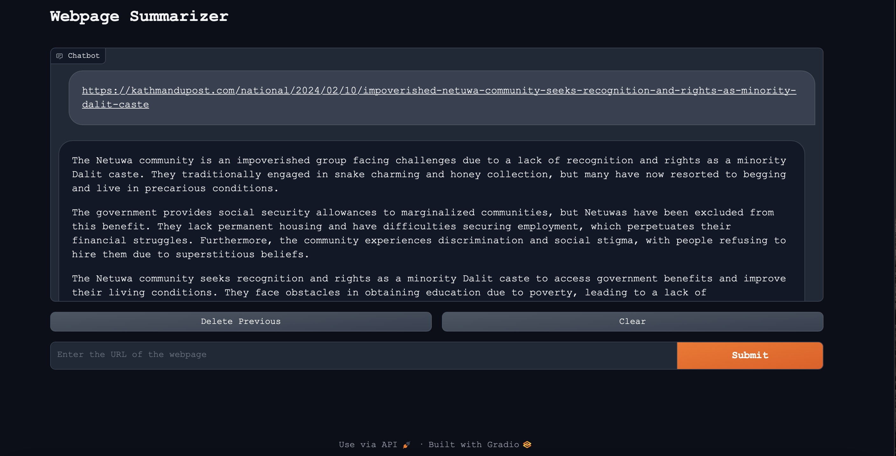

## Setup instruction

```
git clone https://github.com/bivek-shrestha/Website_Summarizer.git
```

remove Pipfiles like Pipfile , Pipfile.lock

```
rm -rf Pipfile Pipfile.lock
```

set up ur virtual env and install dependencies

```
pip install -r requirements.txt
```

## Libaries used

[Gemini ](!https://ai.google.dev/tutorials/python_quickstart)

[Selenium](!https://www.selenium.dev/documentation/)

[Gradio](!https://www.gradio.app)


